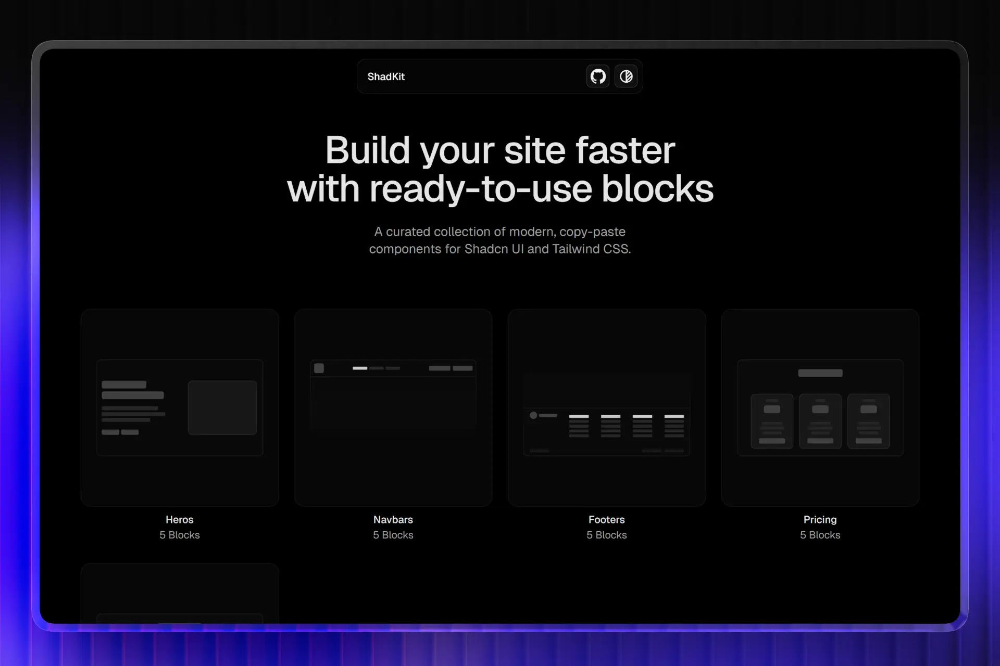

# ShadKit

ShadKit is a curated collection of modern, ready-to-use UI blocks built with **shadcn/ui** and **Tailwind CSS**. All blocks are designed to be copied and pasted directly into your project.

🌐 Live site: [https://shadkit.vercel.app](https://shadkit.vercel.app)



---

## ✨ Features

* Copy‑paste ready blocks
* Built with shadcn/ui + Tailwind CSS
* Modern, clean, and responsive design
* No lock‑in, no dependencies beyond shadcn
* Free and open source

---

## 🧱 What you’ll find

* Hero sections
* Feature sections
* Pricing blocks
* Call‑to‑action sections
* Layout and content blocks

More blocks are added progressively.

---

## 🚀 Getting started

1. Make sure you have **shadcn/ui** installed in your project
2. Browse the blocks on ShadKit
3. Copy the block you want
4. Paste it into your codebase
5. Customize as needed

That’s it.

---

## 🛠 Tech stack

* React
* Next.js (App Router)
* Tailwind CSS
* shadcn/ui

---

## 📦 Local development

```bash
pnpm install
pnpm dev
```

Then open `http://localhost:3000`.

---

## 🤝 Contributing

Contributions are welcome.

* New blocks
* Improvements to existing blocks
* Bug fixes

Open a PR or start a discussion.

---

## ⭐ Credits

Built by Kevin Padilla.

If you find ShadKit useful, consider giving the repo a star.
